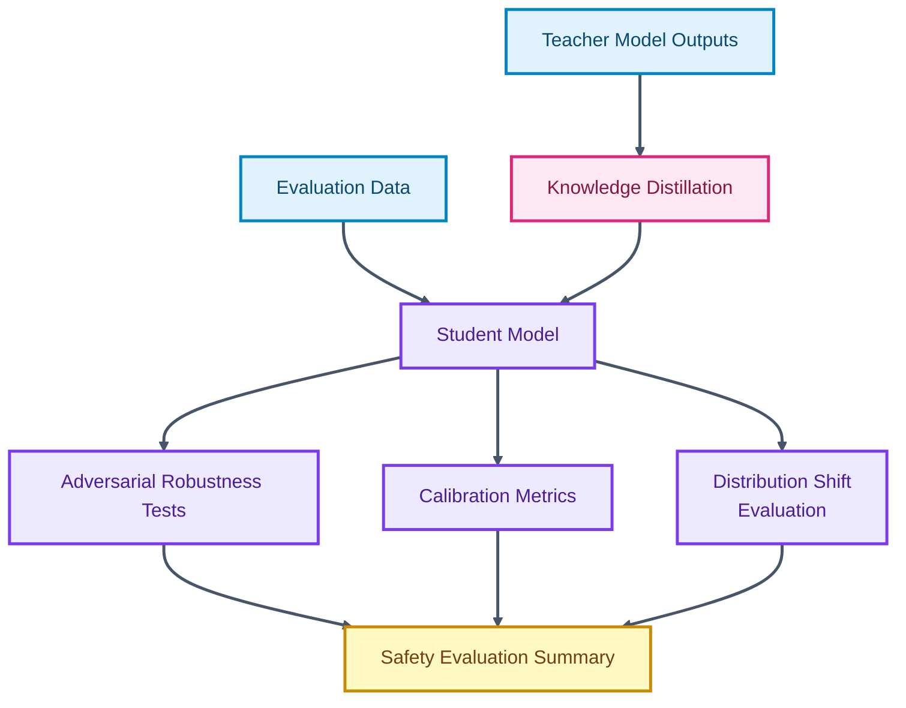

# Knowledge Distillation for Safety-Critical Applications

<p align="center">

  
  
  
</p>

<p align="center">
  <strong>A compact-model training and evaluation workflow for studying robustness, calibration, and distribution-shift behavior.</strong>
</p>

This project explores how student models can learn from larger teachers while preserving reliability under challenging conditions. It focuses on adversarial robustness, calibration quality, and performance under distribution shifts.

## Core Capabilities

- Implements knowledge-distillation evaluation workflows.
- Assesses adversarial robustness using attack-style perturbation tests.
- Evaluates calibration and uncertainty behavior.
- Frames compact-model performance for safety-sensitive contexts.

## Technical Architecture

The repository includes a primary evaluation script and documentation describing the project objectives, metrics, and experimental workflow. It is intentionally compact for focused experimentation.

## Architecture Diagram



## Technology Stack

- Python for experiment execution.
- PyTorch-oriented model evaluation workflow.
- Robustness and calibration metrics.
- Notebook/script-ready structure for future experiment expansion.

## Repository Structure

- `evaluation.py` - Evaluation workflow.
- `LICENSE` - Repository license.
- `README.md` - Project documentation.

## Getting Started

```bash
python -m venv .venv
source .venv/bin/activate
pip install torch numpy scikit-learn matplotlib
```

```bash
python evaluation.py
```

## Professional Context

This project demonstrates model-compression research awareness, safety-oriented evaluation, and disciplined ML experiment framing.
